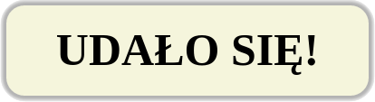

# CSS &ndash; Zaawansowany atrybut border

> Zadania rozwiązuj w plikach ```index.html``` oraz ```css/style.css```

## **Uwaga: nie używaj generatorów do tych zadań.**

## Zadania rozwiązywane z wykładowcą

### Mainpulacja elementem (~ 4min - 6min)
Stwórz element __div__ i nadaj mu klasę __popup__. Ostyluj element tak, aby uzyskać następujący wygląd:



Style:

* szerokość __400px__,
* wysokość __100px__,
* kolor tła __beige__,
* cień - wyśrodkowany, __5px__ rozmycie, __5px__ szerokość cienia, kolor __rgba(0,0,0,0.3)__,
* tekst wyśrodkowany w poziomie, wielkość czcionki __50px__, przesunięty od góry o __20px__, waga czcionki __700__,
* zaokrąglenie rogów __20px__.

-------------------------------------------------------------------------------

## Zadania do samodzielnego wykonania

### Zadanie 1. Border radius (~ 6 min - 8 min)
W pliku **html** stwórz element **div** z dowolnym, krótkim tekstem. Wymiary możesz ustawić tak, żeby było Ci wygodnie robić poszczególne zadania. Ostyluj element **div** na trzy następujące sposoby:

|elipsa|koło|limonka|
|:--:|:--:|:--:|
| | |	|


### Zadanie 2. Border shadow (~ 6 min - 8 min)
W pliku **html** stwórz element **div** z dowolnym, krótkim tekstem. Wymiary możesz ustawić tak, żeby było Ci wygodnie robić poszczególne zadania. Ostyluj element **div** na trzy następujące sposoby:
1. Czerwony, ostry cień dookoła całego elementu na odległość ```5px```.
1. Niebieski cień u góry na odległość ```10px``` z dużym blurem, czerwony cień na dole na odległość ```10px``` bez blura z przeźroczystością ustawioną na ```15%```.
1. Ostry cień skierowany na skos.
