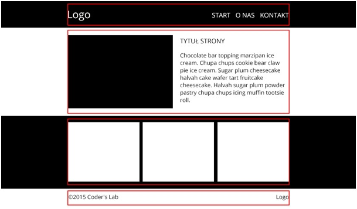

# CSS &ndash; Podsumowanie obowiązkowe

> Zadania rozwiązuj w plikach ```index.html``` oraz ```css/style.css```

## Zadania rozwiązywane z wykładowcą

### Prawdziwa strona (~ 30min+)



**Wskazówki**
* Podziel stronę odpowiednio (**section**, **header**, **footer**).
* Czarne tło pod **headerem** oraz pod trzema **boksami** powinny być rozciągnięte na ```100%``` szerokości strony.
* Linie czerwone przedstawione na powyższym przykładzie traktuj jako linie pomocnicze będące obramowaniem kontenera środkującego. Odpowiednio go nazwij np. ```main_width```.
