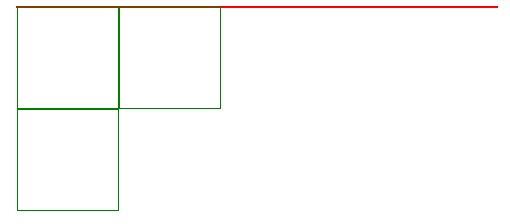
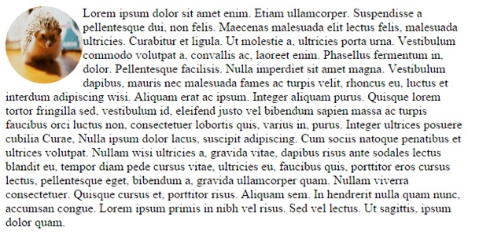
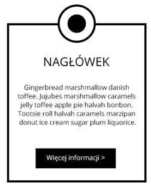
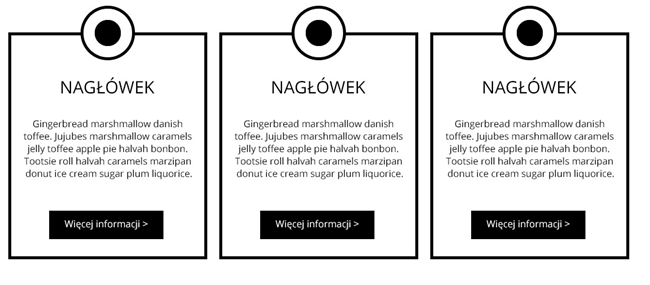

# CSS &ndash; Pozycjonowanie elementów

> Zadania rozwiązuj w plikach ```index.html``` oraz ```css/style.css```

## Zadania rozwiązywane z wykładowcą

### Pozycjonowanie elementów (~ 4min - 6min)

1. Stwórz dwa elementy **div**, ustaw je po obu stronach okna przeglądarki (kwadraty o boku __100px__ oraz obramowaniu ```border: 1px solid green```).

2. Stwórz element **div** o klasie **parent**, ustaw mu szerokość ```800px``` oraz ```border: 1px solid red```.
Do tego elementu wklej **divy** z poprzedniego podpunktu. Zobacz, jak tym razem ustawione zostały te elementy.

3. Elementy **div** z poprzedniego podpunktu ustaw obok siebie za pomocą **float** (obok siebie, nie po przeciwnej stronie przeglądarki - musisz zmienić poprzednie ustawienia). Dodaj trzeci **div**. Za pomocą **clear** przesuń ostatni **div** na dół.



Dlaczego element o klasie **parent** nie ma wysokości? Jak to naprawić?

-------------------------------------------------------------------------------

## Zadania do samodzielnego wykonania

### Zadanie 1. Proste menu (~ 2 min - 4 min)
Stwórz listę ```ul``` z pięcioma elementami (np. jakieś menu). Ustaw jego elementy obok siebie za pomocą **float**.

### Zadanie 2. Zaawansowane pozycjonowanie - 1 (~ 4min - 6min)
Ustaw obrazek w taki sposób jak pokazano niżej. Obrazek znajdziesz w katalogu **images**. Nazwa pliku ```jez.jpg```.



### Zadanie 3. Zaawansowane pozycjonowanie - 2 (~ 4min - 6min)
Obrazek z poprzedniego zadania przesuń według schematu poniżej:


### Zadanie 4. Trzeci wymiar (~ 4min - 6min)
Stwórz w osobnym elemencie **div** dwa obrazki (mogą być takie same). Ustaw im właściwości **z-index** tak jak poniżej.


### Zadanie 5. Zakładka (~ 8min - 10 min)
Stwórz następujący układ:



### Zadanie 6. Rząd zakładek (~ 3min - 5min)
Stwórz następujący układ:


