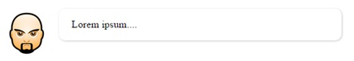

# CSS &ndash; Zaawansowane selektory


> Zadania rozwiązuj w plikach ```index.html``` oraz ```css/style.css```

## Zadania rozwiązywane z wykładowcą

### Dynamiczne pseudoklasy (~ 6min - 8min)
W pliku **html** stwórz element **div** o wymiarach ```400px``` na ```300px``` i krótkim, dowolnym tekstem.
* Stwórz regułę CSS, która spowoduje, że po najechaniu kursorem myszy na **div** zmieni on kolor tła na niebieski i będzie miał eliptyczny kształt (atrybut ```border-radius```).
* Stwórz regułę CSS, która spowoduje, że po kliknięciu w **div** zmieni on znowu kolor na biały, a pod nim narysuje się niebieski cień (rozmyty).

Zobacz, jak działają te reguły. Co się stanie, jeżeli zamienisz je miejscami? Czy potrafisz wytłumaczyć, dlaczego zachowanie selektorów zmienia się w zależności od ich kolejności?

-------------------------------------------------------------------------------

## Zadania do samodzielnego wykonania

### Zadanie 1. Selektory dla linków (~ 5min - 7min)
* W pliku **html** stwórz kilkanaście linków do innych stron internetowych.
* Stwórz regułę CSS, która spowoduje, że linki będą wyświetlać się jako guziki o szerokości wypisanego w nich tekstu i zaokrąglonych krawędziach. Guziki mają mieć kolor żółty.
* Stwórz regułę CSS, która sprawi, że po najechaniu na link kursorem myszy guzik zmieni kolor na zielony.
* Po kliknięciu guzika ma on zmienić kolor na szary (odwiedzony link).

Zobacz, jak działają te reguły. Co się stanie, jeżeli zamienisz je miejscami?


### Zadanie 2. Pseudoklasy związane z położeniem (~ 6min - 8min)
Otwórz link do [JSFiddle](https://jsfiddle.net/CodersLab/t1mp4gv3/). Ustaw style następującym elementom:
* Lista o **id** ```navigation``` &ndash; elementy mają występować po sobie, mieć stałą szerokość (```75px```) i kolor tła.
* Pierwszy element z listy o **id** ```navigation``` ma mieć  zaokrąglone krawędzie po lewej stronie, a ostatni element  &ndash; po prawej stronie.
* Każdy nieparzysty paragraf **diva** o **id** ```zebra``` ma mieć szary kolor tła.
* Pierwszy **div** znajdujący się w **divie** o **id** ```other``` ma być zielony, a ostatni  &ndash; niebieski.
* Każdy 3,5,7,… element **div** od końca należący do **diva** o **id** ```from_end``` ma mieć kolor tła nastawiony na pomarańczowy.


### Zadanie 3. Komentarz na stronie (~ 5min - 7min)
W pliku **html** stwórz **div** z przykładowym tekstem i obrazkiem (avatarem). Ostyluj go następująco:




### Zadanie 4. Zebra (~ 7min -9min)
* W pliku **html** stwórz tablicę o trzech kolumnach i siedmiu wierszach (wraz z nagłówkiem).
* Stwórz regułę CSS, która spowoduje, że wiersz z nagłówkiem będzie miał inny kolor niż inne wiersze (np. ciemny niebieski), a jego tekst będzie biały i pogrubiony.
* Stwórz regułę CSS, która spowoduje, że każdy parzysty rząd będzie miał kolor tła nastawiony na bardzo jasny niebieski.
* Stwórz regułę CSS, która spowoduje, że każdy nieparzysty rząd (ale nie nagłówek) będzie miał kolor tła nastawiony na niebieski.
* Stwórz regułę CSS, która spowoduje, że komórka, nad którą trzymamy kursor myszy, ma tekst napisany na czerwono. Polecenie to nie dotyczy nagłówka.


### Zadanie dodatkowe
Poćwicz selektory, korzystając z tej strony [flukeout.github.io](http://flukeout.github.io/) &ndash; lekcje od 14. do końca.
