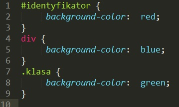

# CSS &ndash; Kaskadowe arkusze stylów

> Zadania rozwiązuj w plikach ```index.html``` oraz ```css/style.css```

## Zadania rozwiązywane z wykładowcą

### Zrozumienie kaskadowości (~ 3min - 5min)
Stwórz jeden **paragraf**, ustaw dla niego poniższe style i przetestuj ich działanie.


  Potrafisz wytłumaczyć rezultat? Rozumiesz jak działa przesłanianie?

 -------------------------------------------------------------------------------

## Zadania do samodzielnego wykonania

### Zadanie 1. Tworzenie elementów i nadawanie styli (~ 3min - 5min)
Stwórz dwa **paragrafy** i ostyluj każdy w następujący sposób:
* pierwszemu ustaw wielkość fontu ```font-size: 20px```,
* drugiemu ustaw wielkość fontu ```font-size: 10px```.

###  Zadanie 2. Nadawanie styli wielu elementom jednocześnie (~ 4min - 6min)
Stwórz dwa **paragrafy** oraz jeden element **span** i wszystkim elementom ustaw tło w kolorze żółtym (```yellow```).

###  Zadanie 3. Zrozumienie spcyficzności selektorów (~ 5min - 7min)
Stwórz jeden **div**. Wpisz do niego dowolny, krótki tekst. Nadaj elementowi identyfikator oraz klasę. Następnie w CSS ostyluj go w następujący sposób:



 Sprawdź, które tło zostanie przypisane elementowi **div**.

###  Zadanie 4. Słowo kluczowe !important (~ 3min - 5min)
Wróć do paragrafu z zadania pierwszego. Wymuś na nim użycie pierwszego stylu (```font-size: 12px```) za pomocą słowa kluczowego ```!important```.
